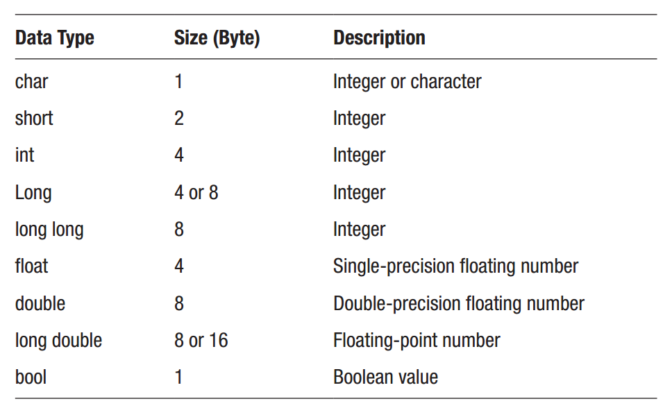

Chapter 3: Variables
^^^^^^^^^^^^^^^^^^^^^^^^^^^

变量用于在程序运行过程中将数据存储于内存中。

数据类型
==============

依据于你需要存储的数据类型，有多种内建数据类型。这些经常被称为基础数据类型或基元。整型（整数）为short，int，long与long long。float，double，与long double类型为浮点（实数）类型。char类型存放一个字符，而bool工包含真值或假值。

在C++中，标准并没有定义基础数据类型的确切尺寸与范围。相反，它们依赖于程序编译所在的系统。前面表中所展示的数据尺寸适用于大部分32位系统，并且以C++字节进行计算。C++中的一个字节是最小的内存编址单位，可保证最小为8位，但依据不同的系统也可以为16位或32位。依据定义，C++中的一个char的大小为一个字节。而且，在32位与64位系统上，int类型为32位。表中的每个整型类型必须至少与前一个类型一样大。这同样适用于浮点类型，每个浮点类型必须至少与前一个类型具有同样的精度。

声明变量
==================

要声明（创建）一个变量，你以变量要存储的数据类型开始，后面跟随标识符，即变量的名字。名字可以包含字母，数据与下划线，但不能以数字开头。它也不能包含空格与特殊字符，并且不能是保留字。

.. code::

    int myInt; // correct
    int 32Int; // incorrect (starts with number)
    int Int 32; // incorrect (contains space)
    int Int@32; // incorrect (contains special character)
    int new; // incorrect (reserved keyword)

赋值变量
===============

要将一个值赋值声明的变量，你必须使用等号，这被称作赋值操作符（=）。

.. code::

    myInt = 50;

声明和赋值可以组合在一条语句中。当一个变量被赋予一个值后，它就变为已定义了。

.. code::

    int myInt = 50;

在变量被声明的同时，有两种赋值或初始化的方法，通过括号或花括号将值括起业。下面的示例与前面的语句是等效的。

.. code::

    int myInt2(50); // direct initialization
    int myInt3{50}; // uniform initialization

如果你需要创建多个相同类型的变量，有一种使用逗号的简便方法：

.. code::

    int x = 1, y = 2, z;

一旦定义了一个变量（声明与赋值），你可以通过简单地引用变量名来使用，例如，进行输出。注意，在这里使用了endl流操作符标记，向输出流添加一个断行。

.. code::

    cout << x << y << endl; // "12"

变量作用域
=================

变量的作用域是指可以使用该变量的代码的范围。在C++中，变量可以声明为全局或局部变量。全局变量是在所有代码块之外声明的，并且可以在其声明之后的任意位置进行访问。与之相对，局部变量是在函数内部声明的，并且仅在此函数内部，在变量被声明之后的位置进行访问。局部变量的作用域也是有限的。全局变量将会存在于整个程序运行期间，而局部变量会在函数完成执行后销毁。

.. code::

    int globalVar; // global variable
    int main() { int localVar; } // local variable

这些变量的默认值也是不同的。全局变量会自动被编译器初始化为零，而局部变量不会被初始化。所有未初始化的局部变量将会包含已存在于内存位置上的垃圾数据。

.. code::

    int globalVar; // initialized to 0
    int main()
    {
        int localVar; // uninitialized
    }

使用未被初始化的变量是一种常见的编程错误，并会导致不可预期的结果。因而在声明局部变量时为你的局部变量指定一个初始值总是一个好主意。

.. code::

    int main()
    {
        int localVar = 0; // initialized to 0
    }

整型
==============

依据你希望变量存储多大的数字，有四种可用的整数类型。

.. code::

    char myChar = 0; // -128 to +127
    short myShort = 0; // -32768 to +32767
    int myInt = 0; // -2^31 to +2^31-1
    long myLong = 0; // -2^31 to +2^31-1

C++11标准化了第五种整数类型，long long，该类型可以保证至少为64位大小。许多编译器在C++11标准完成之前已开始支持该数据类型，包括Microsoft C++编译器。

.. code::

    long long myL2 = 0; // -2^63 to +2^63-1

要确定一个数据类型的大小，你可以使用sizeof操作符。此操作符返回数据类型在你正在编译的系统中所占用的字节数。

.. code::

    cout << sizeof(myChar) // 1 byte (per definition)
        << sizeof(myShort) // 2
        << sizeof(myInt) // 4
        << sizeof(myLong) // 4
        << sizeof(myL2); // 8

固定大小的整数类型被添加到C++11中。这些类型属性于std命名空间，并且可以通过cstdint标准库头文件来包含。

.. code::

    #include <cstdint>
    using namespace std;
    int8_t myInt8 = 0; // 8 bits
    int16_t myInt16 = 0; // 16 bits
    int32_t myInt32 = 0; // 32 bits
    int64_t myInt64 = 0; // 64 bits

有符号与无符号整型
=======================

默认情况下，所有的整数类型都是有符号，所以同时包含正数与负数值。要显式地将一个变量声明为带符号的，可以使用signed关键字。

.. code::

    signed char myChar = 0; // -128 to +127
    signed short myShort = 0; // -32768 to +32767
    signed int myInt = 0; // -2^31 to +2^31-1
    signed long myLong = 0; // -2^31 to +2^31-1
    signed long long myL2 = 0; // -2^63 to +2^63-1

如果你只需要存储正数值，你可以将整数类型声明为unsigned来翻倍其存储上限。

.. code::

    unsigned char myChar = 0; // 0 to 255
    unsigned short myShort = 0; // 0 to 65535
    unsigned int myInt = 0; // 0 to 2^32-1
    unsigned long myLong = 0; // 0 to 2^32-1
    unsigned long long myL2 = 0; // 0 to 2^64-1

signed与unsigned关键字也可以用作标准独立类型，即表示signed int与unsigned int的简写。

.. code::

    unsigned uInt; // unsigned int
    signed sInt; // signed int

类似地，short与long数据类型也是short int与long int的简写。

.. code::

    short myShort; // short int
    long myLong; // long int

数值字面量
=================

除了标准十进制数，整数也可使用八进制数或十六进制数进行赋值。八进制字面量使用前缀0，而十六进制字面量以0x开头。这里所展示的数字均为相同的数字，即十进制的50。

.. code::

    int myOct = 062; // octal notation (0)
    int myHex = 0x32; // hexadecimal notation (0x)

作为C++14，同时有一个二进制符号，使用0b作为前缀。此版本标准同时添加了一个数字操作符（'），从而使其更容易阅读长整数。下面的二进制数表示十进制数的50。

.. code::

    int myBin = 0b0011'0010; // binary notation (0b)

浮点类型
=================

浮点类型可以存储不同精度类型的实数。

.. code::

    float myFloat; // ~7 digits
    double myDouble; // ~15 digits
    long double myLD; // typically same as double

这里所展示的精度是指数值中的数字数量。一个浮点数可以精确表示7个数字，而一个双精度可以处理15个数字。尝试将多于7位数字赋值给一个float意味着最低位将会近似处理。

.. code::

    myFloat = 12345.678; // rounded to 12345.68

浮点数与双精度浮点数可以使用十进制数或幂次进行赋值。幂次（科学计数）通过添加E或e后跟十进制幂来使用。

.. code::

    myFloat = 3e2; // 3*10^2 = 300

作为C++17，底可以指定为使用0x作为前缀的十六进制数。对于这样的数值，幂次部分使用p而不是e使得首位缩放为2的幂次而不是10。

.. code::

    myFloat = 0xFp2; // 15*2^2 = 60

字面量后缀
===============

整型字面量通常被编译器看作int，或者是满足数据值的更大的类型。后缀可以添加到字面量来改变此计算。对于整型，后缀可以是U与L的组合，分别表示无符号与长整型。C++11同时为long long类型提供LL后缀。这些字母的顺序与大小写并没有影响。

.. code::

    int i = 10;
    long l = 10L;
    unsigned long ul = 10UL;

浮点数字面量被看作一个double，除非特别指定。可以使用F或f后缀来指定浮点类型。类似地，L或l后缀指定了long double类型。

.. code::

    float f = 1.23F;
    double d = 1.23;
    long double ld = 1.23L;

编译器隐式地将字面量转换为所需要的类型，所以字面量的类型区别通常并不是必须的。如果在赋值给一个float变量时而没有F后缀，编译器会给出警告，因为由double至float的转换意味着精度的丢失。

Char类型
=============

char类型通常用于表示ASCII字符。这样的字符常量被包含在单引号中，并且可以存储在一个char类型的变量中。

.. code::

    char c = 'x'; // assigns 120 (ASCII for 'x')

char中在存放的数值与char被输出时显示的字符之间的转换是自动发生的。

.. code::

    cout << c; // prints 'x'

要使得其它的整数类型显示为字符，需要将其显式地转换为char。推荐的方法是使用下面显示的static_cast，其中需要的放入尖括号中。另外一种执行类型转换的方法是使用旧的C风格转换，通过将所需要的类型放入括号中并置于被转换的变量或常量的前面。

.. code::

    int i = c; // assigns 120
    cout << i; // prints 120
    // Prints 'x'
    cout << static_cast<char>(i); // C++ new-style cast
    cout << (char)i; // C-style cast

有多种方法来表示一个字符。通常，ASCII编码为大部分C++编译器所使用。如果代码移植性比较重要，可以通过在char字面量前面放置u8来确保编码。此前缀被添加在C++17中，表示UTF-8编码，ASCII是其中一个子集（前128个字符）。

.. code::

    char ascii = u8'x'; // use UTF-8 encoding

UTF-16与UTF-32编码可以分别使用char16_t与char32_t来表示，这两者被添加到C++11中。为了完整性，C++20同时添加了char8_t，用来表示一个UTF-8字符，其行为与符号字符相同。前缀U表示UTF-32字符，而u前缀表示UTF-16字符。

.. code::

    char8_t c8 = 'A'; // UTF-8 character
    char16_t c16 = u'€'; // UTF-16 character
    char32_t c32 = U' '; // UTF-32 character

布尔类型
==========

bool类型可以存储一个布尔值，该值仅可以为真或假。这些值是使用关键字true与false来指定的。

.. code::

    bool b = false;

当用于整数类型环境中时，布尔值false被转换为零，而true被转换为一。相应地，在布尔环境中，任意非零值被计算为真。注意，下面由int到bool的转换是显式进行的，因为截断会引发编译警告。

.. code::

    int i = false; // 0
    int j = true; // 1
    bool b = static_cast<bool>(32); // true