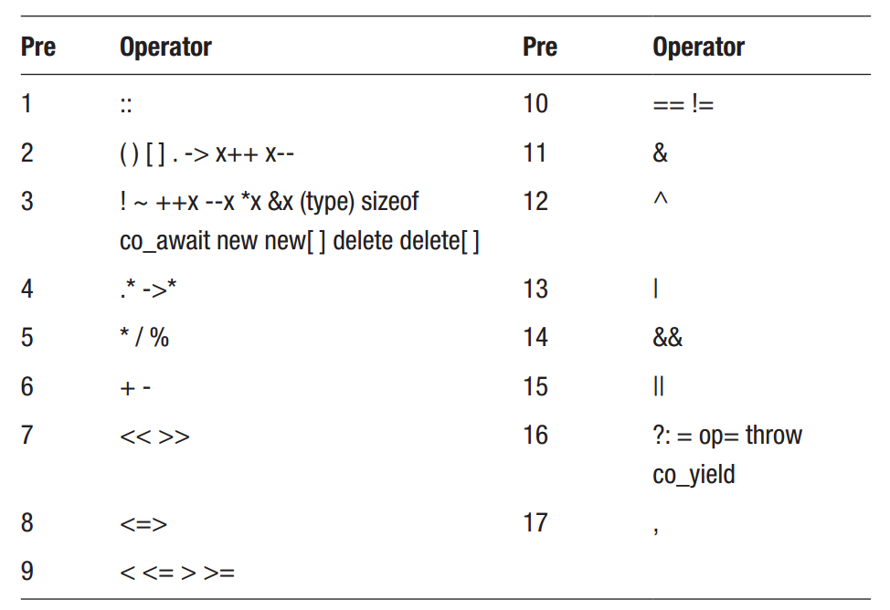

Chapter 4: Operators
^^^^^^^^^^^^^^^^^^^^^^^^^^

操作符是用于操作值的特殊符号。特别用于处理数值的操作符被分为五种类型：算术，赋值，比较，逻辑与位操作符。

算术操作符
==================

算术操作符包括四种基本算术操作，以及取模操作符（%），用于获取余数。

.. code::

    int i = 3 + 2; // 5, addition
        i = 3 - 2; // 1, subtraction
        i = 3 * 2; // 6, multiplication
        i = 3 / 2; // 1, division
        i = 3 % 2; // 1, modulus (division remainder)

注意，除法操作符给出了错误的结果。这是因为它作用于两个整型值上，因而会截断结果并返回整数。要得到正确的值，其中一个数值必须以下列方法之一转换为浮点数值。

.. code::

    float f1 = 3 / 2.0f; // specify as floating-point number
    float f2 = 3 / static_cast<float>(2); // C++ new-style cast
    float f3 = 3 / (float)2; // C-style cast

赋值操作符
===================

下一个类型是赋值操作符。最重要的是赋值操作符（=）本身，它将一个值赋值给一个变量。

.. code::

    int i = 0; // assignment

赋值与算术操作符的一种常见用法是作用于变量，然后将结果保存到相同的变量中。这些操作可以都组合赋值操作符进行简化。

.. code::

    i += 5; // i = i+5;
    i -= 5; // i = i-5;
    i *= 5; // i = i*5;
    i /= 5; // i = i/5;
    i %= 5; // i = i%5;

自增与自减操作符
=====================

另一各常见的操作是将变量增加或减小1。这可以简化为自增（++）与自减（--）操作符。

.. code::

    i++; // i = i+1;
    i--; // i = i-1;

这两个操作符可以用在变量之前或之后。

.. code::

    i++; // post-increment
    i--; // post-decrement
    ++i; // pre-increment
    --i; // pre-decrement

无论哪种操作，变量的结果是相同的。区别在于后置操作符在它修改变量之前返回原始值，而前置操作符首先修改变量，然后返回值。

.. code::

    int x, y;
    x = 5; y = x++; // y=5, x=6
    x = 5; y = ++x; // y=6, x=6

比较操作符
================

比较操作符比较两个值并返回真或假。它们主要用于指定条件，通常是计算为真或假的表达式。

.. code::

    bool b = (2 == 3); // equal to (false)
        b = (2 != 3); // not equal to (true)
        b = (2 > 3); // greater than (false)
        b = (2 < 3); // less than (true)
        b = (2 >= 3); // greater than or equal to (false)
        b = (2 <= 3); // less than or equal to (true)

逻辑操作符
===============

逻辑操作符通常与比较操作符配合使用。逻辑与（&&）如果左侧与右侧均为真则计算为真，而逻辑或（||）如果左侧或右侧为真则为真。要反转布尔结果，可以使用逻辑非（!）操作符。注意，对于逻辑与与逻辑或，如果结果已经由左侧确定，则不会计算右侧。这种行为被称为短路。

.. code::

    bool b = (true && false); // logical and (false)
        b = (true || false); // logical or (true)
        b = !(true); // logical not (false)

位操作符
===============

位操作符可以操作一个整型中的单个位。例如，位或（|）如果操作符任意一侧的位均被设置则得到结果位1。

.. code::

    int i = 5 & 4; // 101 & 100 = 100 (4) // and
    i = 5 | 4; // 101 | 100 = 101 (5) // or
    i = 5 ^ 4; // 101 ^ 100 = 001 (1) // xor
    i = 4 << 1; // 100 << 1 =1000 (8) // left shift
    i = 4 >> 1; // 100 >> 1 = 10 (2) // right shift
    i = ~4; // ~00000100 = 11111011 (-5) // invert

位操作符也有组合赋值操作符。

.. code::

    int i=5; i &= 4; // 101 & 100 = 100 (4) // and
        i=5; i |= 4; // 101 | 100 = 101 (5) // or
        i=5; i ^= 4; // 101 ^ 100 = 001 (1) // xor
        i=5; i <<= 1;// 101 << 1 =1010 (10)// left shift
        i=5; i >>= 1;// 101 >> 1 = 10 (2) // right shift

操作符优先级
==================

在C++中，表达式通常是由左至右计算的。然而，当一个表达式包含多个操作符时，这些操作符的优先级决定了它们计算的顺序。优先级顺序显示在下表中，其中具有最低优先级的操作符将会被首先计算。这种相同的基本顺序同样适用于许多其它语言，例如C，Java与C#。

例如，逻辑与（&&）组合弱于关系操作符，依次组合弱于算术操作符。

.. code::

    bool b = 2+3 > 1*4 && 5/5 == 1; // true

要使得事情更为清晰，可以使用括号来指定首先计算表达式的哪部分。如表中所示，括号是具有最高优先级的操作符。

.. code::

    bool b = ((2+3) > (1*4)) && ((5/5) == 1); // true