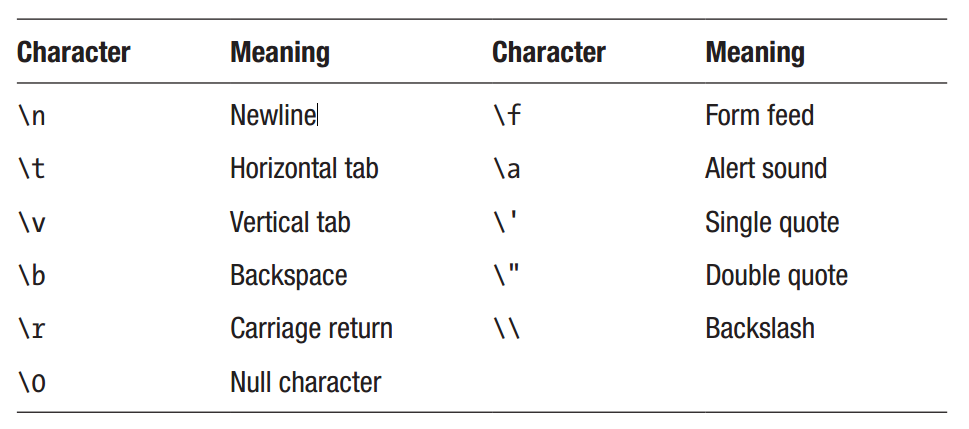

Chapter 8: Strings
^^^^^^^^^^^^^^^^^^^^^

C++中的string类用于存储字符串值。在字符串可以被声明之前，必须包含字符串头文件。也可以使用标准的名字空间，因为string类是名字空间的一部分。

.. code::

    #include <string>
    using namespace std;

然后可以像其它数据类型一样声明字符串。要将一个字符串值赋值给字符串变量，使用双引号分隔字面量，并将其赋值给变量。也可以在字符串声明的同时通过直接或统一初始化为其赋初始值。

.. code::

    string h = "Hello";
    string w ("Hi"); // direct initialization
    string u {"Hey"}; // uniform initialization

字符串组合
=================

加号，即环境下的联合操作符（+），用于组合两个字符串。它还有另一个组合赋值操作符(+=)来添加字符串。

.. code::

    string a = "Hello";
    string b = "World";
    string c = a + " " + b; // Hello World
    a += b; // HelloWorld

只要其作用对象之一为C++字符串，即可应用联合操作符。默认情况下字符串字面量为C风格字符串，由一个字符元素数组构成。字符s可以添加到字符串字面量之后来将其表示为std::string类型。

.. code::

    string d = "Hello" + "World"; // error, no C++ string
    string e = "Hello" + "World"s; // ok
    string f = e + "Again"; // ok

如果没有加号，则字符串字面量也会被隐式组合。

.. code::

    string g = "Hel" "lo"; // ok

转义字符
==============

可以使用反斜线来编写特殊字符，例如新行字符\n。

.. code::

    string s = "Hello\nWorld";

这些特殊字符被称为转义字符，如下表所示。

另外，任意一个128 ASCII字符可以通过反斜线后跟该字符的ASCII码来表示，表示为八进制或十六进制数字。

.. code::

    string oct = "\053"; // octal '+'
    string hex = "\x02B"; // hexadecimal '+'

在C++11中，通过在双引号内的括号中的字符串前面添加R，可以忽略转义字符。这被称为原始字符串字面量，可以用于，例如使得文件路径更可读。

.. code::

    string escaped = "c:\\Windows\\System32\\cmd.exe";
    string raw = R"(c:\Windows\System32\cmd.exe)";

字符串比较
===============

比较两个字符串的方法是简单地使用相等操作符（==）。这不会比较字符串的内存地址，类似于C字符串的情况。

.. code::

    string s = "Hello";
    bool b = (s == "Hello"); // true

字符串函数
================

string类有大量的函数。其中最有用的是length与size函数，两者都会返回字符串中的字符数量。其返回类型为size_t，这是一个用来存放对象大小的无符号数据类型。这只是简单的一个内建数据类型的别名，但具有定义为哪一个则随编译器的不同而变化。别名定义在cstddef标准库头文件中，可以通过iostream包含。

.. code::

    string s = "Hello";
    size_t i = s.length(); // 5, length of string
    i = s.size(); // 5, same as length()

另一个有用的函数是substr（子串），它需要两个参数。第二个参数是要返回的字符数量，由第一个参数所指定的位置开始。

.. code::

    s.substr(0,2); // "He"

字符串中的单个字符也可以使用数组的方法获取或修改。

.. code::

    char c = s[0]; // 'H'

字符串编码
================

以双引号封装的字符串会生成一个char类型的数组，这只能存储256个不同的符号。为支持大字符集，提供了宽字符类型wchar_t。其尺寸会随编译器而变化，所以它并不是平台无关的。这种类型的字符串字面量是通过在字符串前添加大写L来创建的。所得到的数组可以使用wstring类进行存储。该类的作用类似于基础string类，但是使用wchar_t字符类型。

.. code::

    wstring s1 = L"Hello";
    wchar_t *s2 = L"Hello"; // C-style string

在C++11中引入了固定大小的字符类型，即char16_t与char32_t。这些类型分别提供了UTF-16与UTF-32编码的确切表示。UTF-16字符串字面量以u为前缀，并且可以使用u16string类进行存储。类似地，UTF-32字符串字面量以U为前缀，并使用u32string类进行存储。同时添加了u8来表示UTF-8编码字符串字面量。由UTF-8字面量构成的字符串可以存储在C++20中添加的u8string类型中。

.. code::

    string s3 = "Compiler-defined encoding";
    u8string s4 = u8"UTF-8 string";
    u16string s5 = u"UTF-16 string";
    u32string s6 = U"UTF-32 string";

特殊的Unicode字符可以使用转义字符\u后跟表示字符的十六进制数值的方式插入到字符串字面量中。

.. code::

    u8string s7 = u8"Asterisk: \u002A"; // "Asterisk: *"

字符串格式化
====================

相比于古老的字符串格式化函数，例如由C继承来的printf家族，C++20引入了std::format函数作为一种更方便与类型安全的方式来格式化字符串。此函数的第一个参数是要格式化的字符串。出现在字符串中的花括号（{}）将会替换为后续看到的函数参数。

.. code::

    // "1 plus 2 equals 3"
    string f = std::format("1 plus 2 equals {}", 1+2);

花括号可以包含一个数字来指定使用哪个参数进行替换。

.. code::

    // "5 is more than zero"
    string f = std::format("{1} is more than {0}", "zero", 5);