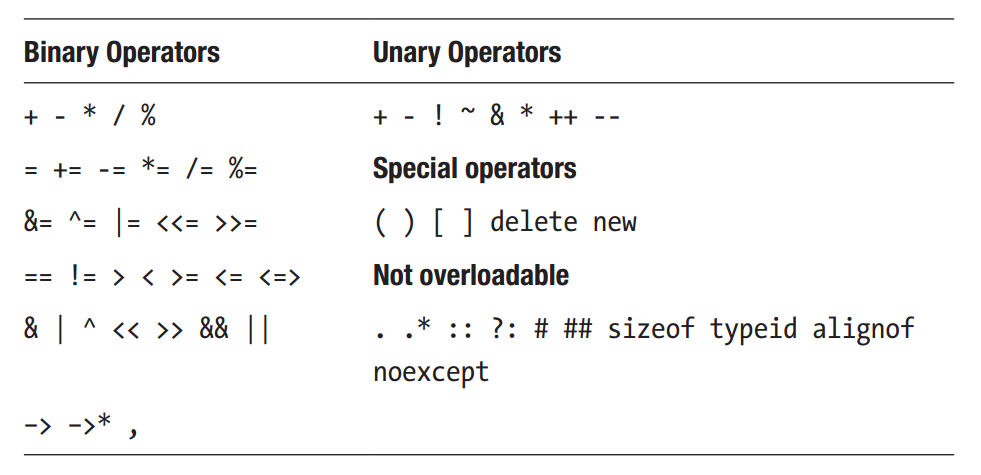

Chapter 20: Operator Overloading
^^^^^^^^^^^^^^^^^^^^^^^^^^^^^^^^^^^^^^^^

操作符重载允许操作符被重新定义并应用于一个或两个操作数均为用户定义类的情况。当它被正确执行时，这可以简化代码并使得用户定义的类像基础类型一样容易使用。

在下面的示例中，有一个名为MyNum的类，其中包含一个整数域以及一个用户设置该域的构造器。该类同时有一个将两个MyNum对象相加并返回新对象作为结果的方法。

.. code::

    class MyNum
    {
        int val;
    public:
        MyNum(int i) : val(i) {}
        MyNum add(const MyNum &a) const {
            return MyNum( val + a.val );
        }
    };

正如这里所看到的，两个MyNum实例可以使用该方法相加。

.. code::

    MyNum a = MyNum(10),
    b = MyNum(5);
    MyNum c = a.add(b);

二进制操作符重载
========================

操作符重载的目的是简化此语法，从而为类提供一个更具有启发性的接口。要将add方法转换为加法符号的重载，将方法名替换为operator关键字后跟要进行重载的操作符。关键字与操作符之间的空白可以选择性忽略。

.. code::

    MyNum operator + (const MyNum &a) const {
        return MyNum( val + a.val );
    }

由于类现在重载了加法符号，该操作符可以用来执行所需要的计算。

.. code::

    MyNum c = a + b;

记住，此操作符只是调用实际方法的一种简单的语法替换。

.. code::

    MyNum d = a.operator+(b);

一元操作符重载
====================

加法是二元操作符，因为它需要两个操作数。第一个操作数是方法调用的对象，而第二个操作数是传递给方法的参数。当重载一元操作符时，例如前缀自增（++），无需方法参数，因为这些操作符仅影响被调用的对象。对于一元操作符，应总是返回与对象相同类型的引用。这是因为，当在对象上使用一元操作符时，程序员希望结果返回相同的对象，而不是一份拷贝。与之相对，当使用二元操作符时，程序员希望返回结果的拷贝，因而应使用按值返回。

.. code::

    // Increment prefix
    MyNum& operator++()
    {
        ++val;
        return *this;
    }

并不是所有的操作符都应按引用返回。两个后缀操作符－后自增与后自减－应按值返回，因为后缀操作符被期望在自增或自减发生前返回对象的状态。注意，后缀操作符指定了一个未使用的int参数。该参数用于将其与前缀操作符相区别。

.. code::

    // Increment postfix
    MyNum operator++(int)
    {
        MyNum t = MyNum(val);
        ++val;
        return t;
    }

比较操作符重载
==================

三路比较操作符（<=>）被添加到C++20中来提供一种简单的方式重载四种比较操作符<，>，<=与>=。当用于整数类型时，正如下面的示例所示，操作符返回一个表示等于，小于或大于的对象。

.. code::

    #include <compare> // std::strong_ordering
    class Length
    {
    public:
        int i;
        std::strong_ordering operator<=>(const Length& right) const {
            return i <=> right.i;
        }
    };

定义了该操作符后，编译器基于该方法自动生成所有四种比较操作符。

.. code::

    int main()
    {
        Length n1 { 1 }, n2 { 2 };
        bool b = n1 < n2; // true
    }

下面的示例展示了如何使用三路比较操作符所得到的结果。

.. code::

    #include <compare>
    #include <iostream>
    int main()
    {
        int x = 5;
        auto result = x <=> 0;
        if (result > 0) { // true
            cout << "5 > 0";
        }
    }

C++20的另一个特性是如果定义了相等操作符（==），则编译器会生成不相等操作符（!=）。正如所期望的，不相等操作符返回相等操作符的逆。

.. code::

    class Length
    {
    public:
        int i;
        bool operator==(const Length& other) const {
            return i == other.i;
        }
    };
    int main()
    {
        Length m1 { 1 }, m2 { 2 };
        bool b1 = m1 == m2; // false
        bool b2 = m1 != m2; // true
    }

四种比较操作符（<，>，<=与>=）中的任何一种，以及相等（==）与三路比较操作符（<=>）可以显式地指定为默认。这可以使得编译器自动实现指定的比较方法，以域被定义的顺序比较类的域，并且在遇到一个不相等结果时停止。返回类型，顺序类型，基于三路比较操作符的返回类型进行自动推导。如果操作符为默认，正如下面的示例所示，编译器会生成所有六种比较操作符（<，>，<=，>=，==与!=）。

.. code::

    #include <compare>
    class Point
    {
        int x, y;
    public:
        auto operator<=>(const Point&) const = default;
    };
    int main()
    {
        Point p1 { 1, 10 }, p2 { 2, 0 };
        bool b = p1 < p2; // true (p1.x < p2.x)
    }

可重载的操作符
===================

C++允许重载语言中几乎所有的操作符。正如下表所示，大部分操作符是二元类型。其中部分为一元，以及一些特殊操作符。也存在一些不能被重载的操作符。

