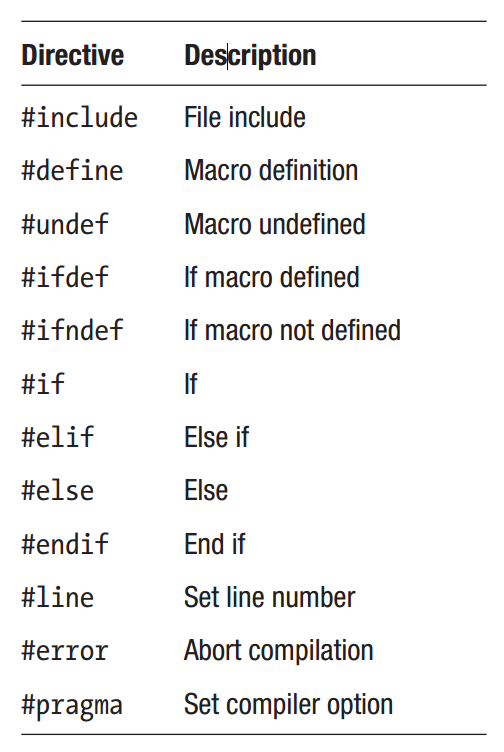
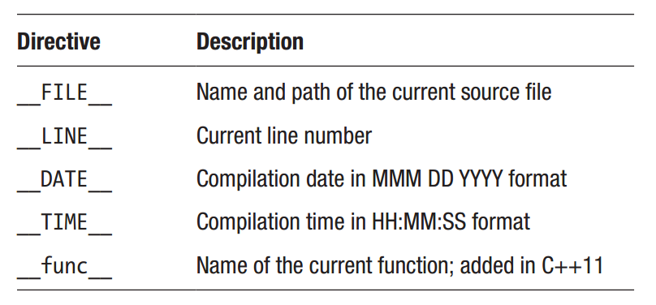

Chapter 24: Preprocessor
^^^^^^^^^^^^^^^^^^^^^^^^^^^^^^^^

预处理器是在编译之前修改源码的文本替换工具。这种修改是依据包含在源文件中的预处理器指令来完成的。这些指令很容易与其它程序代码相区分，因为它们以散列符号（#）开始。它们必须作为一行的第一个非空白字符出现，并且不以分号结束。下表显示了C++中的预处理器指令及其功能。

包含源文件
=====================

#include指令将一个文件的内容插入到当前源文件。它最常见的应用是包含头文件，用户定义的或库头文件。库头文件包含在尖括号（<>）中。这通知预处理器在配置用于查找标准头文件的默认目录中查找头文件。

.. code::

    #include <iostream> // search library directory

你所创建的用于你自己程序的头文件包含在双引号（""）中。然后预处理器会在当前文件的相同目录下查找头文件。如果没有找到，预处理器会在配置用于查找头文件的目录下内查找，最后会在标准头文件的默认目录内查找。

.. code::

    #include "MyFile.h" // search current, configured and default directories

双引号形式也可以用于指定文件的绝对或相对路径，尽管并不推荐这样指定路径。

.. code::

    #include "C:\MyFile.h" // absolute path
    #include "..\MyFile.h" // relative path

define
=====================

另一个重要的指令是#define，用来创建编译时常量，也被称为宏。在此指令之后，指定的常量名为其后的内容所替代。

.. code::

    #define PI 3.14 // macro definition

预处理器会遍历文件并将此常量的内容代替为其后定义中的内容。

.. code::

    double d = PI; // d = 3.14

约定宏以大写字符命名并且每个单词以下划线分隔。这样当阅读源码时，它们很容易定位。

undefine
===================

#define指令不应被用来直接覆盖前面定义的宏。这样做会导致编译器警告。为改变一个宏，它首先需要使用#undef指令进行未定义。尝试未定义一个当前并未定义的宏并不会生成警告。

.. code::

    #undef PI // undefine
    #undef PI // allowed

预定义宏
==============

存在大量编译器预定义的宏。为将其预定义的宏相区别，其名字通常以双下划线开始和结束。下表列出了一些更为有用的预定义宏。

预定义宏的一个常见应用是提供调试信息。例如，下面的错误信息包含了消息发生的文件名与行号。

.. code::

    cout << "Error in " << __FILE__ << " at line " << __LINE__;

宏函数
============

宏可以处理参数。这允许它们来定义编译时函数。例如，下面的宏函数给出了其参数的平方。

.. code::

    #define SQUARE(x) ((x)*(x))

宏函数的调用就如同普通C++函数一样。需要记住的是，此类函数要正常作用，参数必须在编译时已知。

.. code::

    int x = SQUARE(2); // 4

注意宏定义中的额外括号。它们用于避免操作符优先级问题。如果没有这些括号，下面的示例将会给出不正确的结果，因为乘法会在加法之前执行。

.. code::

    #define SQUARE(x) x*x
    int main()
    {
        int x = SQUARE(1+1); // 1+1*1+1 = 3
    }

要使得宏函数跨越多行，你可以使用反斜线。这会转义标记预处理器指令结束的新行字符。为使其工作，在反斜线后不应有空白符。

.. code::

    #define MAX(a,b) \
    (a)>(b) ? \
    (a): (b)

尽管宏很强大，但它们会使得代码更难于阅读与调试。所以仅在必须时才使用宏，并且宏应尽量短小。C++代码－例如常量变量，枚举类，与constexpr函数－可以比#define指令更高效和安全地实现相同的目的。

.. code::

    #define DEBUG 0
    const bool debug = 0;
    #define FORWARD 1
    #define STOP 0
    #define BACKWARD -1
    enum class dir { forward = 1, stop = 0, backward = -1 };
    #define MAX(a,b) (a)>(b) ? (a): (b)
    constexpr int max(int a, int b) { return a>b ? a:b; }

条件编译
===============

如果满足特定的条件时，用于条件编译的指令可以包含或不包含部分源码。首先，存在#if与#endif指令，可以用于指定当#if指令之后的条件为真时将会包含的代码部分。注意，此条件必须计算为一个常量表达式。

.. code::

    #define DEBUG_LEVEL 3
    #if DEBUG_LEVEL > 2
    // ...
    #endif

类似于C++的if语句，可以包含任意数量的#elif（else if）指令与最后的#else指令。

.. code::

    #if DEBUG_LEVEL > 2
    // ...
    #elif DEBUG_LEVEL == 2
    // ...
    #else
    // ...
    #endif

条件编译同时也提供了注意大块代码以用于测试目的的有用方法。这经常使用普通的多行注意并不能做到，因为它们不能嵌套。

.. code::

    #if 0
    /* Removed from compilation */
    #endif

编译if defined
====================

有时，仅当特定的宏被定义时才应编译某个代码块，而与其值无关。为此，可以使用两人上特殊操作符：defined与!defined（未定义）。

.. code::

    #define DEBUG
    #if defined DEBUG
    // ...
    #elif !defined DEBUG
    // ...
    #endif

相同的作用也可以通过分别使用#ifdef与#ifndef来实现。例如，#ifdef部分仅在指定的宏已在前面定义时才会被编译。注意，一个宏即使未给定值也被认为是已定义。

.. code::

    #ifdef DEBUG
    // ...
    #endif
    #ifndef DEBUG
    // ...
    #endif

Error
==============

当遇到#error指令时，编译为终止。此指令可以用于指确定某行特定的代码是否正在被编译。它也可以带一个参数来指定所生成的编译错误的描述。

.. code::

    #error Compilation aborted

line
========

一个较少被用到的指令是#line，当编译过程中发生错误时可以修改显示的代码行号。此指令之后，行号将会像正常一样逐行加一。此指令可以带一个可选字符串参数，用于设置当错误发生时所显示的文件名。

.. code::

    #line 5 "myapp.cpp"

pragma
==============

最后一个标准指令是#pragma，或实用信息。此指令用于向编译器指定选项，因而它们是厂商相关的。例如，#pragma message被多个编译器用来向构建窗口输出字符串。此指令另一个常见的参数是warning，可以修改编译器如何处理警告。

.. code::

    // Show compiler message
    #pragma message("Hello Compiler")
    // Disable warning 4507
    #pragma warning(disable : 4507)

属性
==========

一个新的标准化语法被引入到C++11中，用于在源码中提供编译器特定的信息，即所谓的属性。属性被放置在双方括号中，依据属性，可应用于代码实体。例如，C++14添加的一个标准属性是[[deprecated]]，指示代码实体的使用已变为不推荐。

.. code::

    // Mark as deprecated
    [[deprecated]] void foo() {}

该属性会使得编译器在此实体被使用时发出警告。可以在此警告中包含一条消息来描述实体为什么被废弃。

.. code::

    [[deprecated("foo() is unsafe, use bar() instead")]]
    void foo() {}

另一个示例是[[noreturn]]属性，向编译器表明函数不会返回给调用函数。这也许是永远循环的函数，抛出异常，或退出程序等情况。

.. code::

    [[noreturn]] void f()
    {
        exit(0); // terminate program
    }

编译器可以该属性进行优化以及提供警告此函数调用之后的语句不会到达。
